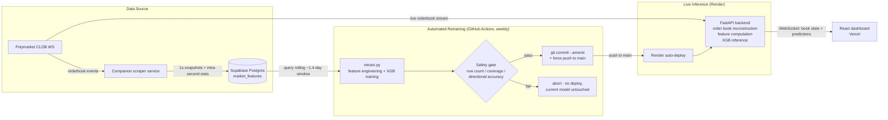

# Polymarket 5-Minute BTC Prediction Dashboard

A real-time price-prediction system for Polymarket's BTC "Up or Down" 5-minute markets. A FastAPI backend reconstructs live order books from Polymarket's websocket feed, runs them through an XGBoost quantile-regression model to forecast prices 5 seconds ahead, and streams the result to a React dashboard. The model retrains itself on a weekly schedule, with an automated safety gate deciding whether each new model is trustworthy enough to deploy.


**Live demo: [polymarket-5m-crypto-prediction.vercel.app](https://polymarket-5m-crypto-prediction.vercel.app/)**

---

## What it does

Every 5 minutes, Polymarket opens a new binary market on whether BTC will be up or down at the end of that window. This project:

1. Connects to Polymarket's CLOB websocket and maintains a live, tick-by-tick reconstruction of both outcome tokens' order books.
2. Computes ~230 microstructure features per second (spread, imbalance, microprice, order-flow imbalance, multi-lag and rolling-window statistics) — matching, feature-for-feature, the pipeline the model was trained on.
3. Feeds those features into six XGBoost quantile-regression models (10th/50th/90th percentile, for each of the two outcome tokens) to forecast each token's price 5 seconds ahead.
4. Streams live order book state and predictions to a React dashboard over a websocket, alongside a link out to the live market itself.
5. Retrains the model weekly against fresh market data, gates the new model behind automated sanity checks, and deploys it only if it passes — with the freshness of the currently-deployed model surfaced directly in the UI.

## Architecture



## Repository structure

```
.
├── backend/
│   ├── main.py                 # FastAPI app: live order book state, feature computation,
│   │                            #   XGB inference, WebSocket + REST endpoints
│   └── requirements.txt
├── frontend/
│   ├── src/
│   │   ├── App.tsx              # Dashboard shell: header, stats, model freshness
│   │   ├── hooks/useMarketStream.ts   # WebSocket client, order book + prediction state
│   │   ├── components/PriceChart.tsx  # Live price + quantile prediction chart (Recharts)
│   │   └── components/OrderBook.tsx   # Live order book depth view
│   └── package.json
├── retrain.py                    # Training pipeline: query → features → XGB fit → save
├── scheduled_retrain.py          # Safety-gated wrapper: retrain, validate, commit, push
├── .github/workflows/
│   └── scheduled_retrain.yml     # Weekly GitHub Actions trigger for the above
├── render.yaml                   # Render web service config
├── vercel.json                   # Vercel build config for frontend/
├── xgb_qreg_5s.joblib             # Deployed model (6 quantile-regression pipelines)
├── xgb_qreg_5s_meta.json          # Feature contract + config the model was trained with
└── requirements.txt               # Training-pipeline dependencies
```

## Data pipeline

Orderbook and price data is collected by a companion scraper service that subscribes to Polymarket's CLOB websocket for the BTC 5-minute market, reconstructs the order book for both outcome tokens, and writes one row per second per token into a Supabase Postgres table (`market_features`). Each row captures top-of-book price and size across the top 5 levels, aggregate bid/ask volume, and (where available) intra-second best-bid/ask extremes. The table retains a rolling window of the most recent data rather than unbounded history — the training pipeline is designed to work well within that constraint (see below).

## Feature engineering

`retrain.py` turns the raw per-second snapshots into a ~230-column feature matrix per prediction:

- **Base microstructure features** — mid price, spread, relative spread, top-of-book and full-book order imbalance, microprice, and the gap between microprice and mid.
- **A custom logit transform on mid price** (`log(1 / (1 - x))`), so the model reasons in a space where price movement near market resolution (as a token's price approaches 0 or 1) is treated with appropriately increasing sensitivity, rather than as noise on a bounded [0, 1] scale.
- **Lag features** (1–5 seconds) and **rolling averages** (3/4/5/10-second windows) over the base features, plus order-flow imbalance (first difference of bid/ask volume).
- **A deliberate consistency constraint on intra-second statistics.** The data source has no reliable per-second max/min ground truth for most columns (it's a single point-in-time snapshot, not a true intra-second aggregate). Rather than let the live backend compute genuine sub-second max/min from its websocket ticks — which would train the model on constants but serve it real variance — both the training pipeline and the live backend deliberately alias these columns to the same per-row value, keeping the two paths statistically identical even at the cost of that signal being unavailable.
- **Joint UP/DOWN feature matrix.** Both outcome tokens' engineered features are computed independently, suffixed (`_up` / `_down`), and joined on timestamp into a single wide row — so each token's model can condition on both tokens' recent order-book behavior, not just its own.

The exact feature list, lag/window configuration, and quantiles are persisted in `xgb_qreg_5s_meta.json` and loaded by the backend at startup, so the serving code never hardcodes the training configuration.

## Model architecture

Six independent gradient-boosted quantile-regression models: one set of three (10th / 50th / 90th percentile) per outcome token, each an `sklearn.Pipeline` of `MinMaxScaler` → `XGBRegressor(objective="reg:quantileerror")`. Targets are the 5-second-ahead change in logit-transformed mid price. `TimeSeriesSplit` cross-validation reports pinball loss and coverage diagnostics before the final models are fit on the full dataset.

At inference time, the backend reconstructs the predicted price by adding the model's predicted (logit-space) return to the current logit-space mid, then inverting the transform — never predicting in raw probability space directly.

## Automated retraining & deployment

```
.github/workflows/scheduled_retrain.yml  →  scheduled_retrain.py  →  retrain.py
```

A GitHub Actions workflow runs weekly (and on demand via manual dispatch), executing `scheduled_retrain.py`, which:

1. Calls the same `train_and_save()` entry point used for manual retrains — one code path for both.
2. Validates the result against fixed thresholds: minimum combined row count, 80%-interval coverage within a healthy band, and directional accuracy above a floor for both outcome tokens.
3. On failure, exits non-zero and touches nothing — the currently-deployed model stays live.
4. On success, commits the retrained model artifacts and pushes to `main` — amending its own previous automated commit in place if one exists, so scheduled retrains don't accumulate one commit (and one ~3MB binary diff) per run indefinitely.

Render auto-deploys the backend on every push to `main`; no separate deploy step is needed. The deployed model's training timestamp is exposed via `GET /api/model_info` and surfaced in the dashboard UI.

## Live inference backend

FastAPI application (`backend/main.py`) exposing:

| Endpoint | Purpose |
|---|---|
| `GET /` | Health check |
| `GET /api/market/{slug}` | Resolve a market slug to its CLOB token IDs via Polymarket's Gamma API |
| `GET /api/markets/active` | Currently active 5m/15m BTC markets |
| `GET /api/model_info` | Deployed model's training timestamp, feature count, quantiles |
| `WS /ws` | Live order book + prediction stream |

On subscribe, the backend resolves the market's token IDs, opens a websocket connection to Polymarket's CLOB feed, and maintains an in-memory order book per token. Sub-second ticks are buffered and aggregated into 1-second bars using the same aliasing logic as the training pipeline, then run through the loaded XGBoost models once enough history has accumulated in the rolling buffer. Predictions and raw book updates are broadcast to all connected clients over the same websocket.

## Frontend

React 18 + TypeScript + Vite, styled with Tailwind (via CDN) and charted with Recharts. `useMarketStream` owns the websocket lifecycle (auto-reconnect, ref-based hot-path state updates flushed to React state at a fixed interval to avoid render thrashing on a high-frequency stream), while `App.tsx` composes the live price/prediction chart and order book view, auto-switches to the next market at each 5-minute interval boundary, and links directly out to the live Polymarket market being predicted.

## Tech stack

| Layer | Technology |
|---|---|
| ML / training | XGBoost, scikit-learn, pandas, NumPy |
| Backend | FastAPI, Uvicorn, WebSockets, asyncpg |
| Frontend | React, TypeScript, Vite, Recharts, Tailwind CSS |
| Data store | Supabase (Postgres) |
| Hosting | Render (backend), Vercel (frontend) |
| CI / automation | GitHub Actions (scheduled retraining) |

## Local development

**Backend**
```bash
pip install -r backend/requirements.txt
uvicorn backend.main:app --reload
```

**Frontend**
```bash
cd frontend
npm install
cp .env.example .env   # set VITE_API_URL / VITE_WS_URL to your local backend
npm run dev
```

**Retraining pipeline** (requires a `DATABASE_URL` in `.env` pointing at a Postgres instance with a `market_features` table)
```bash
pip install -r requirements.txt
python retrain.py
```

## Deployment

- **Backend** — Render web service, configured via `render.yaml`. Auto-deploys on every push to `main`.
- **Frontend** — Vercel, configured via `vercel.json`. Auto-deploys on every push to `main`.
- **Scheduled retraining** — GitHub Actions (`.github/workflows/scheduled_retrain.yml`), needs a `DATABASE_URL` repository secret and `contents: write` workflow permissions to push retrained models.
